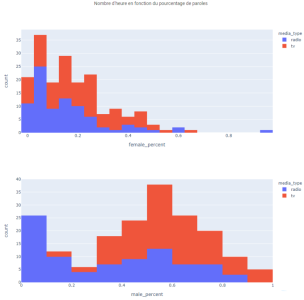
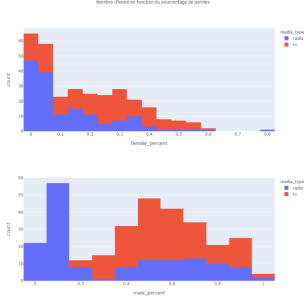
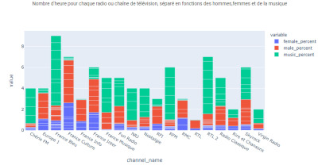
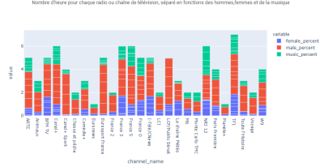
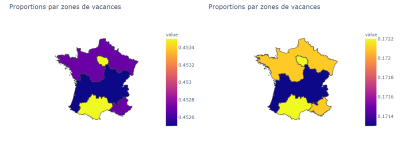

# Temps de parole des hommes et des femmes à la télévision et à la radio

Binôme du projet :<br/>
- Lorenzo Pinaud
- François Meunier

## Table des matières

- [Introduction](#introduction)
- [Guide utilisateur](#guide-utilisateur)
- [Guide développeur](#guide-développeur)
- [Rapport](#rapport)
- [Sources](#lien-vers-les-sources)

## Introduction

D'après Oxfam "Les inégalités entre les femmes et les hommes sont les plus universelles et les plus structurantes de nos sociétés."
Ces inégalités appartiennent à de nombreuses sphères de notre société, en France comme ailleurs.<br/>
La lecture de l'article "Les femmes occupent moins d'un tiers du temps de parole de l'audiovisuel" (Les Échos) révèle des chiffres impressionnants :
"Les femmes ont parlé en moyenne 32,8 % du temps à la télévision et 31,4 % à la radio en 2018, selon une vaste étude de l'INA.".

Ce sujet nous tenant à coeur et important d'un point de vue sociétal, nous avons voulu comparer les temps de paroles à la radio et à la télévision; vérifiant ainsi les chiffres énoncés dans cet article.

## Guide utilisateur

### Récupérer les données

Il faut télécharger le fochier constituant la base de données (voir 'sources'), le placer dans le dossier 'data processing' puis le renommer 'df_radio_tv'.<br>
Ensuite il est nécessaire d'exécuter le nettoyage des données, en exécutant les scripts python du notebook 'df_processing'. Il faut renommer le fichier .csv obtenu 'processed_data' et le placer à la racine du projet, au même emplacement que 'dashboard_radio_tv'.

### Comment lancer le dashboard
Il est demandé d'utiliser anaconda prompt car l'environnement conda est utilisé pour certains modules.

On installe les modules nécessaires avec les commandes suivantes:
```
pip install plotly_express
pip install shapely
pip install pandas
pip install dash
pip install numpy
```
et avec conda:

```
conda install geoviews
conda install geopandas
```

Il reste à se positionner dans le dossier où le fichier python est enregistrer et faire la commande :

```
python dashboard_radio_tv.py
```
Le lancement du site est assez long (environ 2 min) à cause du scrapping des différents datasets.<br/>
À partir du moment la commande suivante apparait (montrant que le site est lancé) :
```
Dash is running on http://127.0.0.1:8050/

 * Serving Flask app "dashboard_radio_tv_femmes" (lazy loading)
 * Environment: production
   WARNING: This is a development server. Do not use it in a production deployment.
   Use a production WSGI server instead.
 * Debug mode: on
```
Il faudra attendre encore quelques minutes que la page se connecte au serveur, elle le fait d'elle même, pas besoin de rafraichir la page.

L'url est :http://127.0.0.1:8050/

## Guide développeur

Le traitement des bases de données s'effectue dans les 2 notebooks : df_processing.ipynb et df_map_processing.ipynb<br/>
Les étapes sont expliquées et le code y est commenté. On génère ainsi les fichiers de données pour le dashboard.

Les fichiers .csv que l'on utilise ensuite sont les suivants  :
- processed_data.csv contenant toutes les données par chaine de radio et de télévision.
- df_zones.csv contenant le pourcentage de temps de paroles homme, femme et le reste

On utilise le fichier regions.geojson pour récuperer les polygones permettant de dessiner la carte interactive.


## Rapport

### Études ddes graphiques
#### Histogramme

 &nbsp;         
    


Ce graphique affiche le nombres d'heures en ordonnée en fonction du pourcentages de paroles pour les femmes.<br/>
On peut voir qu'en moyenne, le 22 novemebre 2010, la plupart des heures de diffusion avaient un pourcentage de moins de 20% où le temps de radio était consacré à des femmes.

 &nbsp;         
    


Ce graphique affiche le nombres d'heures en ordonnés en fonction du pourcentages de paroles pour les hommes.<br/>
De même, le 22 novembre 2010 la moyenne de temps de paroles masculine était de 60%, ce qui est le triple de la moyenne feminine.
Ce pourcentage et un peu différent pour la radio car il y a quand même 25 heures toutes radio confondues qui ont un temps de parole inférieur à 10%.

#### Graphiques en barres

 &nbsp;         
    


Pour la radio, étant donné que certaines chaînes sont destinées à diffuser de la musique la pluspart du temps il est logique d'avoir un temps de parole total faible.<br/>
Pour l'ensemble des chaînes on observe clairement qu'en moyenne le temps de parole des hommes est plus important que celui des femmes. Cela même pour des chaînes de débats (comme France Inter ou France Info) où justement une partié aurait été la plus attendue et logique.

 &nbsp;         
    


Concernant la télévision, le constat est le même mais la moyenne du temps de parole des hommes est plus importante qu'à la radio. <br/>
On peut noter une proportion écrasante du temps de parole des hommes sur la chaîne "Canal+ Sport". A savoir, les femmes occupent moins de 1% du temps de parole.<br/>
Cela semble justifiable quand à ce que la chaîne diffuse, c'est en adéquation avec le public. Mais cela peut justement permettre le maintien des stéréotypes.
Créant ainsi une boucle où les programmes sont considérés comme masculins, donc peu de femme, spectatrice ou professionnelle, s'y intéresse en conséquences.

#### Carte géolocalisé

 &nbsp;         
    


Entre les zones A, B ou C les temps de parole, que ce soit pour les hommes ou pour les femmes, ne change pas distinctement : on est obligé d'avoir des pourcentages au 10000ème afin d'observer des colorations différentes entre les zones.<br/>
Cependant, cela nous permet de comparer le temps de parole global sur une année entre les hommes et les femmes.
En moyenne (de 2010 à 2019), on observe que la part de parole des hommes est autour de 45% à l'année et en dessous de 20% pour les femmes. Donc les femmes occupent environ 30% du temps de parole.

### Conclusion

Si l'on se réfère à l'article dont nous avons fait part en introduction, les femmes parleraient environ 30% du temps à la télévision et à la radio. Par rapport à notre jeu de donnée le résulat s'avère être vrai.<br/>
Il n'y a nul doute que la parité concernant le temps de parole dans nos médias est loin d'être atteinte, cependant l'écart commence à réduire timidement depuis 10 ans.

## Lien vers les sources

Base de donnée : https://www.data.gouv.fr/fr/datasets/temps-de-parole-des-hommes-et-des-femmes-a-la-television-et-a-la-radio/<br/>
Puis "temps de musique et temps de parole des hommes et des femmes à la TV et à la radio"<br>
Article - Les Echos : https://cutt.ly/VgIHzUB<br/>
Fichier geojson des régions françaises : https://france-geojson.gregoiredavid.fr/<br/>
